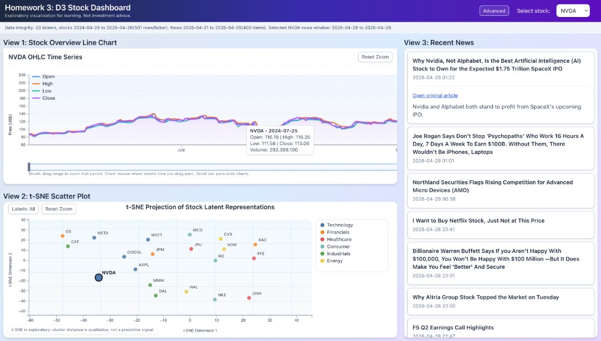
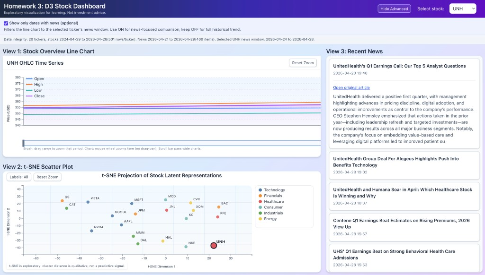

# Homework 3: D3 Stock Dashboard

This assignment is a React + TypeScript dashboard (Vite, D3, Tailwind) for exploratory stock visualization. The main title in the app is **Homework 3: D3 Stock Dashboard**, and each panel matches that writeup: 
**View 1: Stock Overview Line Chart**
**View 2: t-SNE Scatter Plot**
**View 3: Recent News**

Choosing a ticker in **Select stock** links all three views.

**View 1** plots OHLC with wheel zoom on the chart, a **time-range brush** under the x-axis to zoom a selected span, hover tooltips, and reset zoom.
**View 2** shows sector-colored t-SNE points with zoom, optional ticker labels, and click-to-select (equivalent to the dropdown)
**View 3** loads expandable news articles for the selected stock. 

In **Advanced**, **Show only dates with news (optional)** filters View 1 to dates that have news so price and article windows align. A **Data integrity** line under the header summarizes dataset date spans.

## UI Preview

Default dashboard layout:



Advanced mode with "Show only dates with news (optional)" enabled:



## Tech Stack

- Frontend: React, TypeScript, Vite
- Visualization: D3.js
- Styling: Tailwind CSS

## Prerequisites

Before running, make sure you have:

- Node.js 18+ (Node.js 20+ recommended)
- npm 

## Setup and Run Instructions (From Scratch)

### 1. Navigate to the project folder

```bash
cd "/ecs273-26s/Homework3/yourFolder"
```

### 2. Install required packages

```bash
npm install
```

### 3. Start the development server

```bash
npm run dev
```

### 4. Open the app in browser

Vite will print a local URL in the terminal (usually):

```text
http://localhost:5173
```

### Run linter

```bash
npm run lint
```

## Data Layout

Place input files under `data/` in the following structure:

```text
data/
├── stockdata/
│   ├── AAPL.csv
│   ├── NVDA.csv
│   └── ...
├── stocknews/
│   ├── AAPL/
│   │   ├── <news-file>.txt
│   │   └── ...
│   └── ...
└── tsne.csv
```

Files used by the app:

- `data/stockdata/*.csv` for OHLC time-series data
- `data/stocknews/**/*.txt` for per-ticker news articles
- `data/tsne.csv` (or `data/tsne*.csv`) for t-SNE points

## Notes

- This submission is frontend-only and does not require a separate backend service.
- If `npm run dev` fails due to port conflict, Vite may choose another port automatically.

## Limitations

- **Time alignment:** Stock history and news cover different spans; linking views is for exploration only, not proof of cause.
- **t-SNE:** Distances are qualitative; not stable predictions or investment signals.
- **Scope:** Fixed ticker set and local news snapshots; educational use only and not trading advice.

## Use of AI 
- Used claude tool in understanding D3 and its uses for this assignment. 