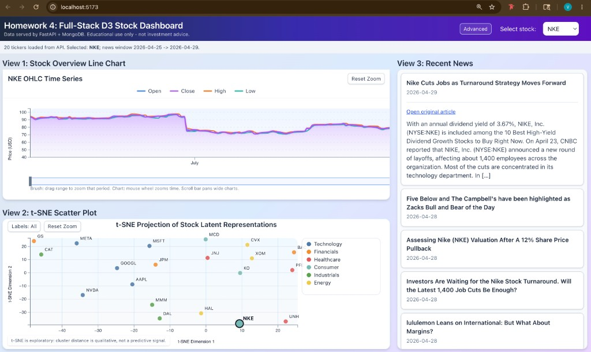
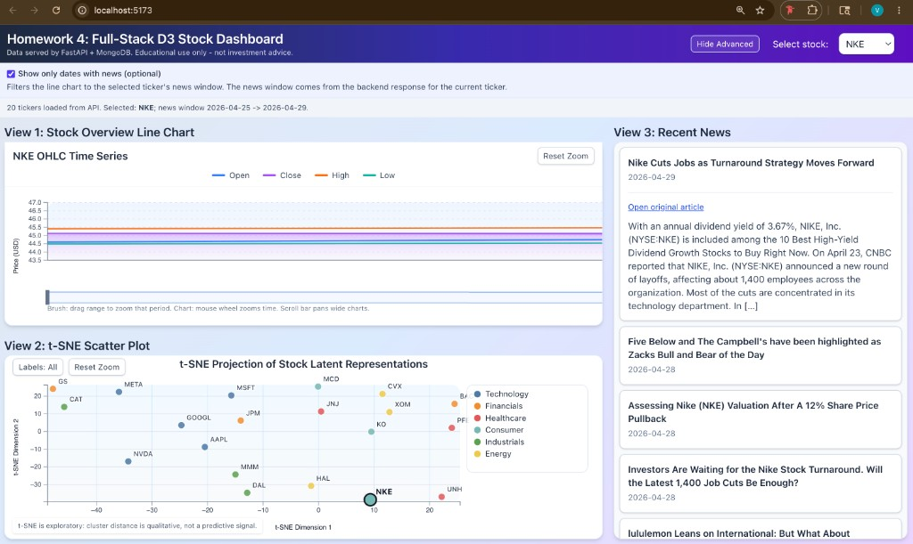

# Homework 4: Full-Stack D3 Stock Dashboard

This is the Homework 4 submission.
It extends the Homework 3 React + D3 dashboard into a full-stack web application:

- **Backend**: FastAPI + Motor (async MongoDB driver), serving JSON.
- **Database**: MongoDB, database name `stock_vmansur`.
- **Frontend**: React + TypeScript + Vite + D3, identical visualizations to HW3
  but every chart now reads from the FastAPI API instead of local CSV/text files.

```
Homework4/vmansur/
├── README.md
├── client/
└── server/
    ├── data/
    │   ├── stockdata/
    │   ├── stocknews/
    │   └── tsne.csv
    ├── data_scheme.py
    ├── import_data.py
    ├── main.py
    └── requirements.txt
```

## UI Preview

Default dashboard layout:



Advanced mode with "Show only dates with news (optional)" enabled:



## Prerequisites

- Python 3.10+ (3.11 recommended).
- Node.js 18+ (Node 20+ recommended) and `npm`.
- A local MongoDB server reachable at `mongodb://localhost:27017`.

---

## MongoDB setup

### 1. Install MongoDB Community Server

```bash
brew tap mongodb/brew
brew install mongodb-community@7.0
```

### 2. Start the MongoDB server

The backend connects to `mongodb://localhost:27017`, so the server just needs
to be listening on that port:

```bash
brew services start mongodb-community
```

### 3. That is it for setup

- the database `stock_vmansur`,
- any collections (`stock_list`, `stock_prices`, `stock_news`, `tsne`),
- any indexes,
- any users (the default `localhost` Mongo install has no auth and the backend
  uses no credentials).

The next step (`python import_data.py`) will create everything.

### What the importer creates in MongoDB

Schemas follow the template (`StockModelV2`, `StockNewsModel`, `tsneDataModel`)
in `server/data_scheme.py`.

## Backend Setup

### 1. Navigate to the backend folder

```bash
cd Homework4/vmansur/server
```

### 2. Create and activate a Python virtual environment

```bash
python -m venv .venv
source .venv/bin/activate          
```

### 3. Install Python dependencies

```bash
pip install -r requirements.txt
```

### 4. Import the data into MongoDB

```bash
python import_data.py
```

Expected output ends with `Done.` and reports counts for each collection.

### 5. Run the FastAPI server

```bash
uvicorn main:app --reload --port 8000
```

#### Endpoints

| Method | Path                                | Response model         | Description                                                                              |
| ------ | ----------------------------------- | ---------------------- | ---------------------------------------------------------------------------------------- |
| `GET`  | `/health`                           | n/a                    | Liveness probe (`{status, database}`).                                                   |
| `GET`  | `/stock_list`                       | `StockListModel`       | Tickers known to the system.                                                             |
| `GET`  | `/stock/{stock_name}`               | `StockModelV2`         | OHLCV series for one ticker (`name`, `stock_series[]`). Returns **404** for unknown tickers. |
| `GET`  | `/stocknews/?stock_name=TICKER`     | `StockNewsModelList`   | All news for the ticker, newest first. Returns an empty `News` list for unknown tickers. |
| `GET`  | `/tsne/`                            | `tsneDataModelList`    | Every t-SNE point (one row per ticker) — used by the scatter plot.                       |
| `GET`  | `/tsne/{stock_name}`                | `tsneDataModel`        | Single t-SNE row for one ticker (useful for detail/highlighting). 404 if unknown.        |

---

## Frontend Setup

### 1. Navigate to the frontend folder

```bash
cd Homework4/vmansur/client
```

### 2. Install npm dependencies

```bash
npm install
```

### 3. Start the dev server

```bash
npm run dev
```

Open the URL Vite prints (usually <http://localhost:5173>). The backend must
be running on `http://localhost:8000`. 

### What the frontend does

- The ticker dropdown is populated from `GET /stock_list`.
- View 1 (line chart) fetches `GET /stock/{ticker}` when the selection changes.
- View 2 (t-SNE scatter) loads `GET /tsne/` once and highlights/zooms to the
  selected stock.
- View 3 (news list) fetches `GET /stocknews/?stock_name=TICKER`.
- No CSV or `.txt` files are read from the browser anymore — all data flows
  through the API.

---

## End-to-End Quick Start (Three Terminals)

```bash
# terminal 1 — MongoDB (only needed the first time / after a reboot)
brew services start mongodb-community   # or: docker start mongo

# terminal 2 — backend
cd Homework4/vmansur/server
source .venv/bin/activate
python import_data.py        # first time only (or whenever data changes)
uvicorn main:app --reload --port 8000

# terminal 3 — frontend
cd Homework4/vmansur/client
npm install                  # first time only
npm run dev
```

---

## Use of AI

- Claude was used to understand the FastAPI. 